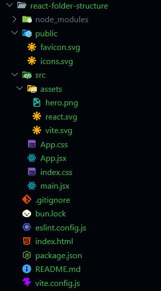

# React folder structure and Naming Convensions

- node_modules => Contains all the codes of dependencies, libraries etc. (Ignore it)
- public => This folder contains all static files (images, video, fonts etc.)
- src => Source contains the main code of our project. (CSS, JSX, js etc.)
- main.jsx => main root entry point of our application code
- App.jsx => Contains code of the application.
- eslint.config.js => Condifurations of ESLint, Show errors in the code
- .gitignore => Git tool se kisi files/folder ko ignore krvane ke liye. eg. node_modules, .env etc.
- index.html => Main html page of our website
- package.json => Defines all the dependencies, dev dependencies and there versions. scripts, package-name, version,
- vite.config.js => configurations of vite

- react, and react-dom are different.
- React => create UI
- React-dom => check difference between virtual dom, and updates Browser DOM.

For mobile development, ths combo is like

- React => create UI
- React Native => Update UI,

---

# Naming Convensions

- camelCase => variables, functions, methods, properties, file-names etc.
- PascalCase => Components, class names, types, etc.
- snake_case => Not used much in JS but common in Python.
- kebab-case => common for file-names, css classes, ids etc.
